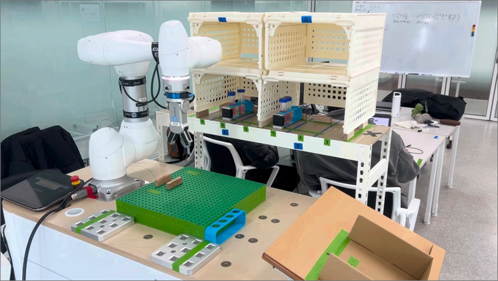

# 바이오뱅크 검체 이송 관리 자동화 시스템


[](https://youtu.be/qSOLFy9Ex48)
↑ 이미지 클릭 시 데모 영상을 확인할 수 있습니다.

바이오뱅크 워크셀에서 **랙(RACK) 이송**과 **튜브(TUBE) 이송**을 ROS 2 Action 기반으로 통합 제어하는 프로젝트입니다.

이 저장소는 프로젝트 소스만 포함합니다. **Doosan ROS 2 패키지(`doosan-robot2`)는 저장소에 포함하지 않고 외부 의존성으로 설치합니다.**

---

## 1. 프로젝트 개요

- 분야: 바이오뱅크 검체 이송 자동화
- 주요 기술: ROS 2 Humble, Python, PySide6, ROS 2 Action
- 로봇 기준: Doosan M0609 설정 기준
- 주요 구성:
  - UI 노드
  - 메인 오케스트레이터 노드
  - 로봇 제어 Action 서버
  - ROS 2 Action 인터페이스 패키지

---

## 2. 프로젝트 목표

- 작업자가 수동으로 처리하던 랙 이송과 튜브 이송 절차를 하나의 ROS 2 제어 흐름으로 통합합니다.
- UI 입력, 명령 해석, 좌표 변환, 로봇 동작, 예외 복구를 분리된 노드 구조로 관리합니다.
- 실제 장비 환경에서도 재사용할 수 있도록 Action 기반 인터페이스와 스테이션 테이블 중심 구조를 유지합니다.

---

## 3. 저장소 구조

```text
bio-transport-automation/
├── README.md
├── requirements.txt
├── .gitignore
├── docs/
│   ├── Flow_chart.png
│   ├── bio-transport-automation.png
│   └── archive/
└── src/
    ├── bio_transport/
    └── bio_transport_interfaces/
```

### 폴더 설명

| 경로 | 설명 |
|---|---|
| `docs/` | 흐름도, 문서, 보관용 자료 |
| `docs/archive/` | 발표자료, 대용량 보관 파일 등 |
| `src/bio_transport/` | 메인 실행 패키지 |
| `src/bio_transport_interfaces/` | ROS 2 Action 인터페이스 패키지 |

---

## 4. 외부 의존성

이 저장소에는 `doosan-robot2`를 포함하지 않습니다.

같은 ROS 2 워크스페이스의 `src/` 폴더에 별도로 설치해야 합니다.

```bash
cd ~/ros2_ws/src
git clone -b humble https://github.com/DoosanRobotics/doosan-robot2.git
```

최종 워크스페이스 구조 예시는 다음과 같습니다.

```text
ros2_ws/
└── src/
    ├── bio-transport-automation/
    │   ├── docs/
    │   └── src/
    │       ├── bio_transport/
    │       └── bio_transport_interfaces/
    └── doosan-robot2/
```

> 참고: `bio_transport` 패키지는 런치 파일에서 `dsr_bringup2` 패키지를 찾습니다. 따라서 `doosan-robot2`가 같은 ROS 2 워크스페이스에 설치되어 있어야 합니다.

---

## 5. 주요 패키지

### 5-1. `bio_transport`

메인 실행 패키지입니다.

실행 노드:

| 실행 이름 | 역할 |
|---|---|
| `bio_main` | 메인 오케스트레이터 |
| `bio_sub` | 로봇 제어 Action 서버 |
| `bio_ui` | PySide6 기반 UI |

주요 기능:

- UI 명령 파싱
- RACK / TUBE / HOME / EMERGENCY 명령 분류
- 스테이션 이름을 로봇 접근 좌표로 변환
- Action 기반 작업 요청 및 결과 처리
- 긴급 정지 및 HOME 복귀 흐름 처리

### 5-2. `bio_transport_interfaces`

ROS 2 Action 정의 패키지입니다.

| Action | 용도 |
|---|---|
| `BioCommand.action` | UI와 메인 오케스트레이터 사이의 명령 전달 |
| `RobotMove.action` | 메인 오케스트레이터와 로봇 제어 서버 사이의 랙 이송 요청 |
| `TubeTransport.action` | 튜브 이송 요청 |

---

## 6. 시스템 FLOW

1. UI에서 작업 명령을 입력합니다.
2. `bio_main`이 명령 타입을 판별하고 유효성을 검사합니다.
3. 스테이션 이름을 실제 접근 좌표와 작업 좌표로 변환합니다.
4. `bio_main`이 하위 Action 서버에 작업을 요청합니다.
5. `bio_sub`가 로봇 동작을 수행합니다.
6. 작업 성공 또는 실패 결과를 상위 노드로 반환합니다.
7. 필요 시 HOME 복귀 또는 긴급 정지 복구 흐름을 수행합니다.

---

## 7. Technical Highlights

### 7-1. Command Parsing and Dispatch

- UI 입력 명령을 `RACK`, `TUBE`, `HOME`, `EMERGENCY` 유형으로 분류합니다.
- 명령 형식과 목적지 정보를 검증한 뒤 적절한 작업 흐름으로 전달합니다.
- 메인 오케스트레이터가 작업 상태를 관리하며 순차적으로 명령을 처리합니다.

### 7-2. Station-Based Coordinate Resolution

- 랙과 튜브 위치를 사전 정의된 스테이션 테이블 기준으로 해석합니다.
- 위치 이름을 실제 접근 좌표와 작업 좌표로 변환합니다.
- 서로 다른 작업 위치를 동일한 명령 형식으로 처리할 수 있습니다.

### 7-3. Action-Oriented Task Sequencing

- 상위 노드는 `RobotMove`, `TubeTransport`, `BioCommand` 액션을 통해 작업을 요청합니다.
- 하위 제어 노드는 로봇 작업 단계를 순차적으로 수행합니다.
- 작업 결과를 액션 응답으로 반환해 상위 흐름 제어에 활용합니다.

### 7-4. Recovery Flow

- 긴급 정지 및 HOME 복귀 흐름을 지원합니다.
- 작업 실패 시 결과 상태를 상위 노드와 UI에 반환합니다.

---

## 8. 설치 및 빌드

### 8-1. ROS 2 환경 로드

```bash
source /opt/ros/humble/setup.bash
```

### 8-2. 워크스페이스 생성

```bash
mkdir -p ~/ros2_ws/src
cd ~/ros2_ws/src
```

### 8-3. Doosan ROS 2 패키지 설치

```bash
git clone -b humble https://github.com/DoosanRobotics/doosan-robot2.git
```

### 8-4. 이 프로젝트 클론

```bash
cd ~/ros2_ws/src
git clone <이 저장소 주소>
```

### 8-5. Python 의존성 설치

```bash
cd ~/ros2_ws/src/bio-transport-automation
pip install -r requirements.txt
```

### 8-6. 빌드

중요: 실제 ROS 2 패키지는 저장소 내부의 `src/` 폴더에 있습니다. 따라서 `colcon build` 실행 시 패키지 경로를 명시합니다.

```bash
cd ~/ros2_ws
rosdep install -r --from-paths src --ignore-src --rosdistro humble -y

colcon build --symlink-install \
  --base-paths src/bio-transport-automation/src src/doosan-robot2

source install/setup.bash
```

---

## 9. 실행 방법

### 9-1. 통합 실행

기본값은 가상 모드입니다.

```bash
ros2 launch bio_transport bio_integrated.launch.py
```

가상 모드 명시 실행:

```bash
ros2 launch bio_transport bio_integrated.launch.py \
  mode:=virtual \
  host:=127.0.0.1 \
  dry_run:=False \
  skip_probe:=True
```

실제 로봇 모드 실행:

```bash
ros2 launch bio_transport bio_integrated.launch.py \
  mode:=real \
  host:=192.168.1.100 \
  dry_run:=False \
  skip_probe:=False
```

> 실제 로봇 IP는 현장 네트워크 설정에 맞게 변경해야 합니다.

### 9-2. 개별 노드 실행

```bash
ros2 run bio_transport bio_sub --ros-args -p dry_run:=true
ros2 run bio_transport bio_main
ros2 run bio_transport bio_ui
```

---

## 10. 명령 형식

### RACK 명령

```text
RACK,<CMD>,<SRC>,<DST>
```

예시:

```text
RACK,IN,NONE,A-2
```

### TUBE 명령

```text
TUBE,<MODE>,<SRC>,<DST>
```

예시:

```text
TUBE,IN,NONE,A-2-1
```

### HOME / EMERGENCY

```text
HOME,NONE,NONE,NONE
EMERGENCY,STOP,NONE,NONE
```

---

## 11. 문서 및 자료

- 시스템 흐름도: `docs/Flow_chart.png`
- 발표자료 및 보관 자료: `docs/archive/`

---

## 12. 주의사항

- `doosan-robot2`는 이 저장소에 포함하지 않습니다.
- `doosan-robot2`는 같은 ROS 2 워크스페이스에 외부 의존성으로 설치해야 합니다.
- `bio_integrated.launch.py`는 `dsr_bringup2`를 사용합니다.
- `bio_sub`는 Doosan Robot Python API 사용을 전제로 합니다.
- 실제 로봇 모드에서는 로봇 IP, 네트워크 연결, 안전 설정을 현장 환경에 맞게 확인해야 합니다.
```
